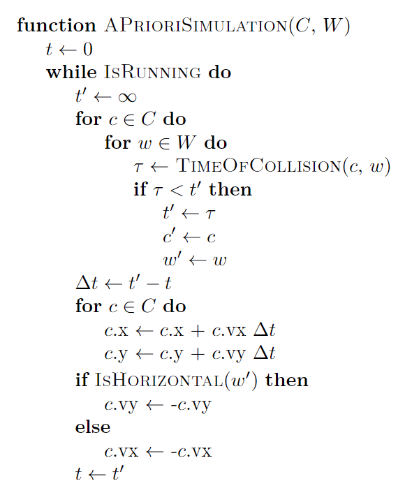
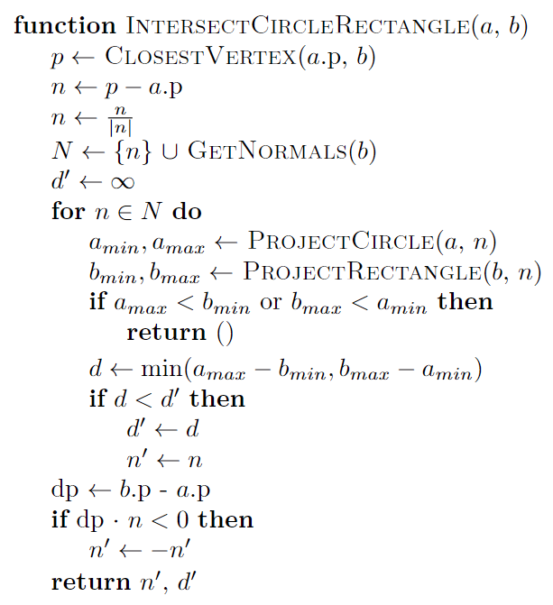

# 4M26 - Rigid Physics Simulation
3D collision detection system cover as part of Part IIB: 4M26

# Getting started

Begin by setting up your virtual environment and install the module:

    python3 -m venv .env
    . .env/bin/activate
    pip install --upgrade pip
    pip install wheel
    pip install -e .

Once this is complete, run the 3D rigid physics simulation using the following command:

    simulation

The result should be a window showing something like the following:


Note that on your first use there will be a complation step that will take some time.
You can control the simulation in the following way:
1. Add spheres by using <kbd>CTRL</kbd> + a left click
2. Add cuboids with <kbd>CTRL</kbd> + a right click.
3. Click and drag to rotate the camera around the center point
4. Use the scroll wheel to zoom in and out
5. Use <kbd>SHIFT</kbd> + drag to pan the camera
6. Press <kbd>R<kbd> at any time to reset the camera to its default position
7. Use <kbd>W</kbd> to move the 3D cursor farther from the camera, and <kbd>S</kbd> to move it closer.

There is also a 2D rigid physics simulation, which can be invoked with the
`simulation-flat` command. It produces a window like the following:


The controls are left click to add a circle, and right click to add a polygon.

> [!TIP]
> Thank you to [@twobitcoder101](https://github.com/twobitcoder101),
> whose [excellent tutorials](https://www.youtube.com/playlist?list=PLSlpr6o9vURwq3oxVZSimY8iC-cdd3kIs)
> were a great help in preparing these lectures.

## A note about Floating Point representation

Floating point numbers do not accurately represent real values. They are simply
integers in disguise. Look at the following bits:


The top bit indicates the *sign* of the number. The next 8 bits are the *exponent*,
which is value from -127 to 127. The last 23 bits are the *significand*. This
scheme is known as IEEE 754. These values combine in the following way to
produce the value:

$$
\begin{align*}
e &= 128 - 127 = 1 \\
s &= 1 + \sum_{n=1}^{23}b_n \times 2^{-n} = 1.57079637050628662109375\\
s \times 2^e &= 3.14159274101257324218750 \\
\pi &= 3.14159265358979323846264
\end{align*}
$$

This means you cannot trust that a floating point calculation will be accurate.
Results will rarely be zero, for example, thus requiring all checks to be against
a range near to zero instead of simple equality checks. Something as simple as
filtering out duplicate values thus becomes a complex undertaking, as equality
cannot be used.

# Modular Design

To turn to our main topic, a rigid physics engine is a complex system consisting
of many different parts. It is tempting to jump into implementation, but some
planning and design can save a lot of headaches later. Let us begin by looking at
some of the different kinds of things that exist in the system:


- Dynamic objects move around within the system (*e.g.* spheres, cuboids)
    * They react to forces like gravity
    * Interact with each other and static objects
    * Visible
- Static objects like the floor and the ledges
    * Collide with dynamic objects
    * Visible
- UI elements like the cursor and debug visualisations
    * Exists in the world coordinate system
    * Visible
- Structural elements
    * Invisible
    * Phantom geometry

As we list these we see that they share some traits (collision, visibility). We
should design our system in a modular way such that these different aspects of
entities can share implementations.

## Entities/Components/Systems

One way of accomplishing this modular design is via the concept of entities,
components, and systems. An entity is a unique element within the simulation,
and is associated with one of more components. Systems act upon all entities
which share a set of components. Let's see an example using the image above:

|          | Floor      | Ledge 1      | Ledge 2     | Sphere | Cube   | Cursor  |
| -------- | ---------- | -------------| ------------| ------ | ------ | ------- |
| Position | (0,-15,0)  | (-7.5,0,0)   | (7.5,7.5,0) | Varies | Varies | Varies  |
| Rotation | (0, 0, 0)  | (0,0,-pi/10) | (0,0,pi/10) | Varies | Varies | (0,0,0) |
| Mass     |            |              |             | Varies | Varies |         |
| Inertia  |            |              |             | Varies | Varies |         |
| Velocity |            |              |             | Varies | Varies |         |
| Color    | Dark Green | Red          | Grey        | Varies | Varies | Black   |
| Size     | (30,3,30)  | (15,1.5,15)  | (15,1.5,15) | Varies | Varies | (1,1,1) |


| System    |                  Components                 |
| --------- | ------------------------------------------- |
| Physics   | Position, Rotation, Mass, Inertia, Velocity |
| Collision | Position, Rotation, Size                    |
| Rendering | Position, Rotation, Size, Color             |

The elegance of this solution is that when a new entity is added, it will
interact with the existing systems by nature of what components are associated
with it.

## Separation of concerns

This is an example of the principle of separation of concerns. Each system can
be implemented in such a way that it only needs to attend to the components and
functionality of that system without concern for how it interacts with other
systems:

- Collision
    * Detect collisions
    * Resolve collisions
- Physics
    * Apply forces
    * Move bodies
- Rendering
    * Collect information for shaders
    * Send to graphics card

# Collision Detection

Now that we have a general framework for designing the simulation, let us look
at the collision system in detail.

## *A Priori*
One way to build a collision detection system is by predicting when collisions
will take place. For example, here we can see a predictive system for circles
colliding with walls in two dimensions:


This works by modeling the future behavior of the system directly. Here is an
algorithm for an *a priori* collision detection system:




See [this file](lecture/apriori.py) for an implementation of this in Python.
This kind of collision detection has the huge advantage of being perfectly
accurate, and not missing any collision. However, this can become increasingly
difficult as the complexity of the simulation increases. For example, what happens
when we add gravity?


How do we find the time of collision now?

$$
\begin{align*}
\mathbf{x} &= \mathbf{x}_0 + \mathbf{v}t + \frac{1}{2}\mathbf{a}t^2 \\
x_w &= x_n + v_nt + \frac{1}{2}a_nt^2 \\
x_n &= (\mathbf{x}_0 - \mathbf{w}_0) \cdot \mathbf{n_w} \\
v_n &= \mathbf{v} \cdot \mathbf{n_w} \\
a_n &= \mathbf{a} \cdot \mathbf{n_w} \\
r &= x_n + v_nt + \frac{1}{2}a_nt^2 \\
t &= \frac{-v_n \pm \sqrt{v_n^2 - 2a_n(x_n-r)}}{a_n}
\end{align*}
$$

However, that's not the whole story. What happens when the ball hits the corner
of this inclined ledge?


$$
\begin{align*}
x &= x_0 + v_xt + a_xt^2 \\
y &= y_0 + v_yt + a_yt^2 \\
r^2 &= (x - x_p)^2 + (y - y_p)^2 \\
0 &= (x_0 + v_xt + a_xt^2)^2 + (y_0 + v_yt + a_yt^2)^2 - r^2
\end{align*}
$$

Now we have to solve a quartic! What happens when we want to add in more objects,
and those inter-body collisions:


While *a priori* methods can be expanded to deal with the addition of rotational
and friction forces and complex intersections, we will look at a simpler approach.

## *A Posteriori*

In *a posteriori* collision detection, we take a small step, resolve any collisions
by separating bodies and applying impulses, and then take another small step.
While this means it is now possible to miss a collision, in practice this is
a more tractable approach to most simulations. It can handle the example above
with little difficulty:


The updated algorithm looks like this:


We have to shift from detecting collisions before they happen to detecting them
after they have occurred. 

### Intersect Circle-to-Circle

Intersecting two circles is easy to do, we simply have to see whether the distance
between their centers is less than the sum of their radii:


### Intersect Rectangle-to-Rectangle

Intersecting two rectangles (or any other pair of convex polygons) is a bit more
complicated. We will need to employ the *separating axis test*:

> If two shapes intersect, there must not exist an axis on which,
> when projected, they are separated

Here is an algorithm for rectangles:


Note how we project the vertices onto each of the axes defined by the normals
of the sides of the rectangles. If the vertices overlap on all axes, then the
two objects intersect. There is an intrinsic advantage to this approach, which
is that we can return from the algorithm once a single separating axis is found.
As most objects will not intersect, this property of the algorithm is desirable.
Furthermore, we get out the normal and depth of penetration, known as the minimum
translation vector (MTV), which we can use to separate the collided bodies.

### Intersect Rectangle-to-Circle

Intersecting rectangles (or convex polygons) with circles is only slightly more
complicated. In addition to the normals of the polygon, we need to find the
axis from the circle to the nearest point on the rectangle:




These algorithms are all implemented in [this file](src/rigidphysics/flat/collisions.py).

## Moving to 3D

Another nice property of the separating axis test is that it translates very
cleanly to 3D. The only wrinkle comes when intersecting spheres and cuboids, as
finding the nearest point on a cuboid to a sphere requires a bit more work:


We rotate and translate the sphere centroid into the frame of the cube and then
use simple axis tests to find the nearest point. Then, we can rotate that point
back into the original coordinate frame.

When building systems like this it is vital to test them thoroughly. Here are
just some of the situations we need to test in 3D:


Examine [this code file](test/test_collide.py) to see how these tests are implemented,
and [this one](src/rigidphysics/collisions.py) for the implementation of the algorithm.

# Geometry

Now that we have detected collisions we can use the MTV to separate them. The
next step is to find the points at which the bodies are in contact (see the yellow
dots below), which we will need to apply physical forces. To do this we need to
apply some computational geometry.


## Contact points on a circle
Any circle that is in contact with another object touches it in one place, that
place being the center of the circle plus the normal of collision times the radius.
This is also true for spheres.

## Contact points on a rectangle
Finding the contact points between two rectangles (or convex polygons) is much
more complex. We need to find all places where a vertex of one polygon intersects
the edge of another polygon, which we can do with the following algorithm:


We see here a great example of the kind of approximate matching we need to
perform with floating point values. In `update_contacts` we update our set
of contacts to be those points which have the same minimum distance. However,
we cannot simply compare to that distance directly. Instead, we need to perform
two checks: (1) is the distance greater than the minimum plus an epsilon? If so,
we can ignore it. (2) is the distance less than the minmum minus an epsilon? If so,
this is the new minimum and we replace the set of contacts entirely. If neither, then
this is a contact which has the "same" distance as the current minimum and we add
it to the set.

These algorithms are implemented in [this code file](src/rigidphysics/flat/contacts.py).

## Contact points on a cuboid
Finding the contact points on a cube is slightly more complicated. We will
use the same closest points trick as we did above to find which vertices touch a
face or lie on an edge. However, we also need to chech for edges which intersect
(study the test scenarios above closely).


See [this code file](src/rigidphysics/contacts.py) for this implementation.

### Skew Lines

3D line segments rarely intersect. As such, testing for segment intersection,
especially in light of floating point inaccuracies, is likely to fail. As such
we make use of the mathematics of [skew lines](https://en.wikipedia.org/wiki/Skew_lines).
The algorithm below:


Aims to find the endpoints of the shortest segment connecting two skew lines:


# Resolving Collisions

We will not spent too much time focusing on the details on collision resolution.
A simplified version that does not require contact points can be seen below:

```python
def resolve_collision_basic(e, a_lv, a_inv_mass, b_lv, b_inv_mass, normal):
    relative_velocity = b_lv - a_lv
    contact_velocity_mag = relative_velocity.dot(normal)
    if contact_velocity_mag > 0:
        # already moving apart
        return

    j = -(1 + e) * contact_velocity_mag
    j /= a_inv_mass + b_inv_mass
    impulse = j * n
    a_lv += -impulse * a_inv_mass
    b_lv += impulse * b_inv_mass
```

This is the equation for a collision between two bodies. If `e` (the
coefficient of restitution) is 1, then this will compute an elastic collision.
With contact points, you can compute more complex physical interactions using
rotation and friction. See [this file](src/rigidphysics/physics.py) for examples
in 3D and [this file](src/rigidphysics/flat/physics.py) for examples in 2D.

# Partitioning Space
You can implement a rigid physics simulation using the basic algorithms we have
just outlined, but it will not be efficient. Both the broad phase and the narrow
phase execute in $O(n^2)$ time. However, before we start looking at optimisation,
it is worth quoting the great Donald Knuth:

> Premature optimization is the root of all evil

It is absolutely the right approach to implement the system using the easy to
understand (and debug!) approach first. Make it work, then (if needed), make it
fast. In the case of the broad phase, we can definitely improve our algorithm by
partitioning space.

## Quad Trees
Consider the flat simulation again:


Each one of these bodies has to check itself against every other body, but there
is no way that a body that is located near the floor could also be intersecting
the top of the ledge. The locality of collision means that we only need to
test bodies that are nearby. We can achieve this by using a spatial extrapolation
of trees known as a quadtree (in 2D) or an octree (in 3D).


Each node in a quad tree is linked to a bounding box in 2D space. Branch nodes
have four (thus quad) children, one for each quadrant of the box. Above you can
see a quad tree superimposed on a frame from the simulation. The axis-aligned
bounding boxes of the bodies are colour-coded to indicate which node they belong
to. Bodies which cross several quadrants are stored in branches higher up the
tree (*e.g.*, the ledges and the floor) whereas smaller objects are only stored in
the leaves.

Here is a snippet of the Python code used for the data structures:

```python
class QuadTree:
    def __init__(self, box: AABB,  
                 max_depth=8, 
                 threshold=16):
        self.box = box
        self.root = Node(box)
        self.max_depth = max_depth
        self.threshold = threshold

class Node:
    def __init__(self, box: AABB):
        self.box = box
        self.c0 = None
        self.c1 = None
        self.c2 = None
        self.c3 = None
        self.values: List[RigidBody] = []
```

> [!Tip]
> In a situation like this where a node has either four children or none, it is
> best to use explicit child attributes instead of a tuple or a list, as
> collections will incur a range of needless computational costs.

Initially the quadtree consists of a single node. As we add bodies to the tree,
it will grow such that it respects the two given constraints: that there are no
more than $t$ bodies per node, and that the tree itself does not exceed $d_{max}$
levels of depth.


Note the logic on split, in which a body only gets added to the child if it
cleanly falls into a quadrant. This is one way in which the threshold constraint
may be violated (*i.e.*, if all the bodies at a level span multiple quadrants).
The other way happens is when maximum depth is reached (that is to say, the
depth constraint is never violated). Once the bodies have been added to this
structure (which is $O(n \log_4{n})$ ) we can then find all intersections as a
single operation:


A few notes about this algorithm:
1. We perform a $O(n^2)$ match at each node, but this is bounded by the threshold
2. Each body in a node can potentially intersect with any of the bodies in the
child nodes, which necessitates the second loop. We can get back some of the
cost of that search by checking if the item overlaps the child box (the
`IsDisjoint` call).
3. Finally we recurse into the children

This algorithm has some nice properties. The depth-first nature of its execution
naturally avoids duplicating the collision tests. While we still need to do a
many-to-many comparison, it is kept under control by the threshold. If the
simulation largely consists of small objects this means that most of the
comparisons will happen in the leaves. However, it is important to note that
quadtrees, when implemented in this way, are very sensitive to the depth and
threshold parameters. The right values will depend on the circumstances at hand.

You can examine a working implementation of a quadtree
[in this file](src/rigidphysics/flat/quadtree.py).

## Spatial Hashing

Let's look at another spatial application for a data structure you have seen
before: the hash table. Given a space filled with bodies like this one:


We will impose a grid, in which each cell is the size of the largest body:


The idea is that, using this grid, we can greatly speed up collision detection
by limiting our many-to-many comparison to a small neighbourhood within the grid
(the $3 \times 3$ grid below)


This same mechanism can be used in 3D, but with voxels and a neighbourhood of
$3 \times 3 \times 3$. Our goal is going to be to build the following hash
table, in which each circle is added to its corresponding spatial cell:


 
We will employ a clever algorithm to build this data structure in $O(n)$ time:

1. Count how many bodies are in each cell in the cell start array $O(n)$ 
2. Compute the cumulative sum of the cell start array $O(c)$
3. For each body, place it in the packed cell entry array using the cell start array $O(n)$

Let's work through this one step at a time.


Counts:


Cumulative sum:


Add the bodies one by one. At each step, we decrease the count at the cell for
that body and insert the body into the cell start array at that index:


The end result is the cell start array and the packed cell entry array, computed
in $O(2n + c)$ time. As $c$ is usually $2n$, this means it grows as $O(n)$.

The 3D simulation uses spatial hashing, and you can view the implementation
[in this file](src/rigidphysics/detection.py).

# Complex Intersections

Now that we have some efficient algorithms for finding possible collisions, we
will turn to checking those collisions in the narrow phase. Here, again, we are
currently using an $O(n^2)$ algorithm. The Separating Axis Test, while easy to
implement and understand, requires $O(n_an_b)$ comparisons where $n_a$ is the
number of normals in polygon $a$. For even-numbered regular polygons
(like rectangles) we can cheat this somewhat because $n=\frac{v}{2}$ due to 
repeated normals, but the overall complexity remains the same. As we deal with
more complex polygons (and their convex hulls where needed), this will become
a problem. To address this, we will explore an interesting property of the
Minkowski difference, and an algorithm which exploits it to create an $O(n)$
algorithm for testing intersection.

## Minkowski Difference

The Minkowski difference is the set of vertices formed of the differences of
two polygons, that is to say:

$$
V_m = \{v_a - v_b \mid v_a \in V_a, v_b \in V_b \}
$$

This set has the interesting property that when $a$ and $b$ intersect, the convex
hull of $V_m$ will contain the origin:


On the left we see the Minkowski difference of the shapes on the right. How can
this property be used to create an algorithm for efficiently testing whether any
two convex polygons intersect in linear time?

## Gilbert-Johnson-Keerthi

The Gilbert-Johnson-Keerthi (GJK) algorithm describes a way to iteratively arrive
at a simplex which either contains the origin (indicating intersection) or
verifies the origin is outside of the convex hull of the Minkowski difference.


We will walk through the algorithm with an example. Below we see the Minkowski
difference for two intersecting polygons:


We begin by choosing a support point at random, in this case picking the
direction $d_1 = [-1, 0]$ for $v_0$. Note that we can use this direction to
select vertices from the polygons, and the corresponding support point is also
in that direction in the Minkowski difference. This properly means that we do
not need to actually compute the difference, we can just compute whatever points
we need on the fly.

The vector from $v_0$ to the origin gives us our second direction $d_2$ and point
$v_2$. Now that we have two points, we can use the 1D simplex (a line) to get our
next direction $d_3$ and point $v_3$. This gives us our first simplex that we can test:


The origin is not contained in this simplex, but we can find which edge of the
triangle is closest to the origin and use it to produce our next direction $d_4$
and $v_4$.


This simplex does contain the origin. We can confirm this using a Voronoi region test:


We use the following algorithm to perform this test:


Note that as $c$ is the last vertex added to the simplex, it is should lie in the
direction of the origin. Thus, we do not need to test $RAB$ in the diagram.

You can see a very simplistic implementation of GJK in [this file](lecture/gjk_images.py),
but if you wish to learn more you should examine a proper implementation, such
as [OpenGJK](https://github.com/MattiaMontanari/openGJK), which implements this
algorithm for 3D polytopes.

# Making Code Faster

When optimising a codebase, there are some general principles you should follow.

## **WRITE TESTS FIRST!**
I cannot emphasize this enough. The most common outcome of optimisation is that
your codebase goes from slow and correct to fast and wrong (the second most
common outcome is slow and wrong). You should make your code work, and then
write a lot of tests, ideally using generative fuzzing, to ensure that you can
tell when and how your optimisations break the codebase.

## Timing
Once you have tests in place, there is one more vital step: timing. You have
two solid tools available in Python for this (there are others, but these are
a good place to start).

### `line-profiler`
[Line Profiler](https://pypi.org/project/line-profiler/) is a python package
that lets you decorate a function with the `@line_profiler.profile`. For
example, let us say you had the following snippet of code:

```python
@line_profiler.profile
def find_intersections(circles: List[Circle]) -> List[Tuple[int, int]]:
    num_circles = len(circles)
    intersections = []
    for i in range(num_circles):
        x1, y1, r1 = circles[i]
        for j in range(0, i):
            x2, y2, r2 = circles[j]
            dx = x2 - x1
            dy = y2 - y1
            distance = math.sqrt(dx * dx + dy * dy)
            radius_sum = r1 + r2
            if distance < radius_sum:
                intersections.append((i, j))

    return intersections
```

It will then provide stats on time spent per line:

```text
Total time: 0.779389 s
File: /home/matjoh/4M26-rigidphysics/lecture/line_profiler_example.py
Function: find_intersections at line 17

Line #      Hits         Time  Per Hit   % Time  Line Contents
==============================================================
    17                                           @line_profiler.profile
    18                                           def find_intersections(circles: List[Circle]) -> List[Tuple[int, int]]:
    19         1          1.4      1.4      0.0      num_circles = len(circles)
    20         1          0.3      0.3      0.0      intersections = []
    21      1001        242.8      0.2      0.0      for i in range(num_circles):
    22      1000        337.7      0.3      0.0          x1, y1, r1 = circles[i]
    23    500500     112248.1      0.2     14.4          for j in range(0, i):
    24    499500     132960.1      0.3     17.1              x2, y2, r2 = circles[j]
    25    499500      97345.9      0.2     12.5              dx = x2 - x1
    26    499500      85943.2      0.2     11.0              dy = y2 - y1
    27    499500     142430.2      0.3     18.3              distance = math.sqrt(dx * dx + dy * dy)
    28    499500      96409.2      0.2     12.4              radius_sum = r1 + r2
    29    499500     107643.1      0.2     13.8              if distance < radius_sum:
    30      6742       3823.4      0.6      0.5                  intersections.append((i, j))
    31                                           
    32         1          3.9      3.9      0.0      return intersections
```

### `time.perf_counter`

Python provides us an easy means of timing code using the built-in
`perf_counter` timer, which is guaranteed to be the highest precision timer
available on the platform. You can use this to get accurate measurements of
how long a function takes to execute by wrapping it in code like the following:

```python
start = time.perf_counter()
do_something()
elapsed = time.perf_counter() - start
```

You can see examples of this [in this code file](test/test_timing.py).

## Better Algorithms
We have seen some examples in these lectures of how algorithms with better
computational complexity are a great way to improve our performance. It is often
the case that someone else has tried to accomplish the same task as you, and
you should take advantage whenever possible of their insights and solutions.
However, if you need to develop an entirely novel solution, you essentially have
three tools at your disposal:
1. **Hashing** - Can you find a way to turn an entity into a (fairly unique)
number? Hash based data structures are often the most performant solution, often
able to turn an $O(\log{n})$ solution into an $O(1)$ solution.
2. **Caching** - Do you need to perform the same task multiple times? Are there
values that you need to compute and use again and again? There is almost always
a time/space tradeoff to be made, in which you can trade some space complexity
for a reduction in time complexity by caching values for later use.
3. **Level of Indirection** - Are you struggling with the shape of your problem
in some way? For example, do you have 5 or 6 copies of the same logic dotted
around your system, or do you have a large function that does many things and
is hard to understand? Breaking complex things down into smaller parts and
encapsulating shared logic into functions and classes often leads to insights
that are otherwise missed.

## Memory Allocation
One solid rule of thumb is that allocation of memory is costly. In a language
like Python, almost everything, from a number to a class, needs to be allocated
in memory. Think of a restaurant, with a set number of tables and chairs. Each table
seats four people, and so when there are parties of four the restaurant can
operate efficiently. However, parties can come in all sizes. Parties of two only
use half a table, and a party of one is even more inefficient. Furthermore, large
parties need multiple tables, and often have to wait for people to finish eating
before they can be seated. If you have ever worked in the food service industry,
you will know that managing this process is a complex undertaking. If you have
ever waited for a table at a restaurant, you know that sometimes you may have to
wait for an indeterminate time to be seated.

Memory allocation in a computer works in almost exactly the same way. Each time a
new object in Python is created it has to ask the allocator for memory, and
when the object is no longer in use that memory is eventually freed for use by
other objects. This process has a cost, and you incur that cost in the so-called
"inner loop" of your program, that is, the code which executes the most often,
then you can experience a significant cost in performance. As such, be aware of
where you create new things, and try to avoid doing so in hot spots. If
possible, use libraries like `numpy`, which allow you to allocate a block of
memory up front (*e.g.*, for a list of integers) and then reuse it, as this will
help avoid these often expensive operations.

## `numba`

If you happen to be writing a system which includes a lot of computation,
especially computation in loops, then you should see whether the
[`numba`](https://numba.pydata.org/) package can help. Python is usually
executed dynamically via an interpreter. However, numba can take certain bits of
Python code and compile them down to machine code, which can make them
significantly faster.  Various places in this codebase use numba, notably
the [maths module](src/rigidphysics/maths.py). Here is a comparison of
performance with and without the use of numba:


Note that this is a log scale! In the case of detection, for example,
`numba` provides two orders of magnitude speedup.
